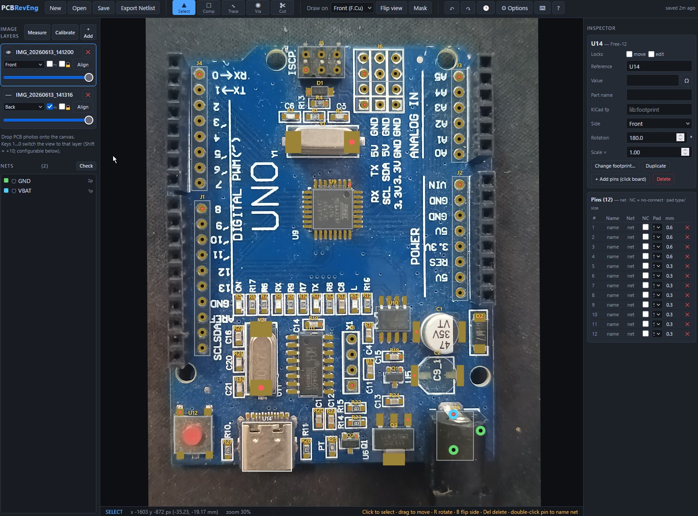
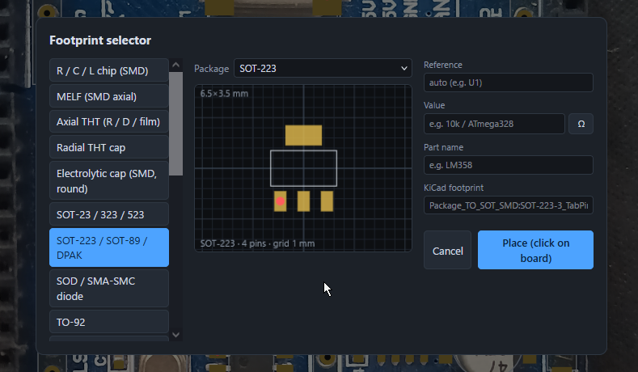
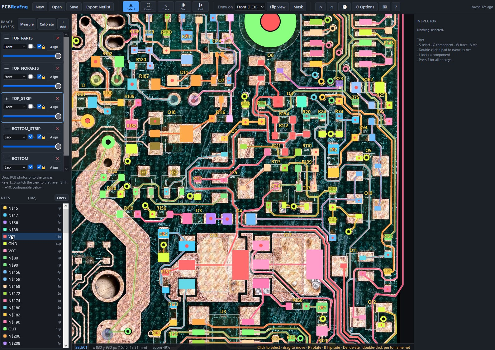
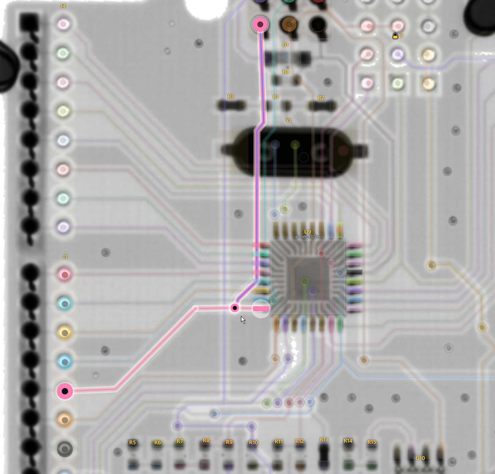

# PCB RevEng - PCB Reverse-Engineering Workbench

### ▶ TRY IT OUT HERE: https://gamerpaddy.github.io/PCB-RevEng/

A zero-dependency open-source web app for reverse-engineering and repairing electronic PCBs from photos and exporting
a netlist you can import into EDAs like KiCad.

No building needed, no CDN, no server-side code. All local in your browser.

## Screenshots

## Running
- **Github:** use the link above or the deployment page to access the latest iteration directly.
- **Locally:** Extract and just open `index.html` in any modern browser, no server needed.
- **On a web host:** just upload the folder to any static host (nginx, GitHub Pages, S3, …).

Your session **autosaves to the browser** (IndexedDB, images included) - F5 or
closing the tab loses nothing; "New" clears it. Use Save/Open for files you
want to keep or move between machines.
Keep in mind that Browser plugins or settings that clear those storages will remove all progress if you didnt save it to a file.
Disabling javascript will stop this software from working completely.

## Workflow

1. **Load photos** deskew, align and calibrate the dimensions.
2. **Assign photos to layers** you can change the amount of layers in options
3. **Place parts** press C and click somewhere for a Quick menu, Hold shift while clicking for the Footprint selector.
4. **Assign values, types, prefixes** etc. make your life easier later by putting in the effort now.
5. **Create Nets** click on pins, edit parts in the inspector or draw wires, its up to you how you connect them.
6. **Edit Schematic** The schematic can be found under the Schematic tab or by pressing F2, arrange the blocks and connect them. Unconnected wires will auto-generate a Net label for Kicad export.
7. **Export** to your favourite EDA as long as it supports the file formats implemented, more to come.

## AI features ##
Yes.. no new software without AI nowadays. But its disabled by default and you dont need to use it, its not being forced on you!

Go to the experimental section to enable it and provide a API key. 

Currently it can support your in 3 tasks, finding pinouts, creating footprints, arranging parts in schematic. 
All highly unreliable and dependend on the weather, universe and what not.  verify results before use.

## New features regularily.
Features change a lot, so i hold back editing this Readme feature list until i hit a equilibrium.

just try it out, you can undo anything and fiddle around in the sample project as much as you like.

**You got an great idea or found a bug? Open a Issue i will look into it.**

## Repair functionality ##
**If you are repairing and dont need the reverse engineering functionality, you are covered aswell.** 

Import allows you to open Boardview .brd and .cad files directly for troubleshooting and fault finding.

## License ##
I dont care about licenses really, do whatever you want but dont be an a-hole. 
